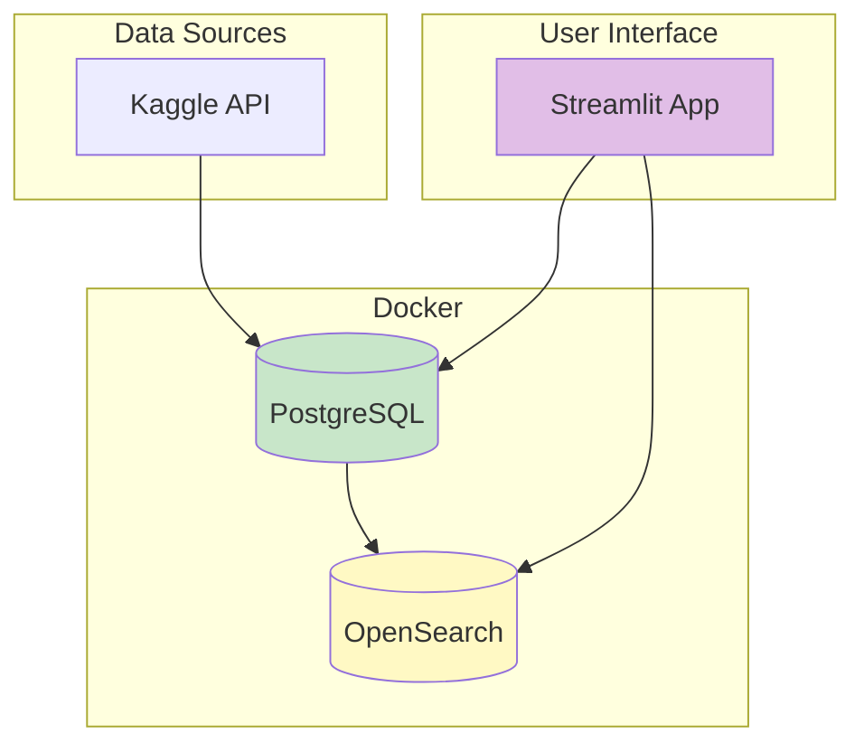
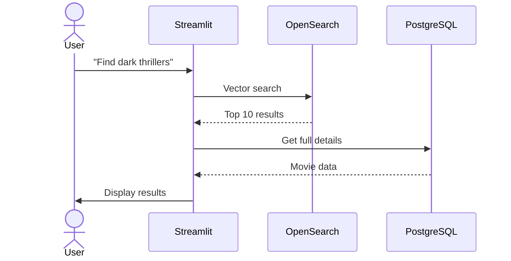

## System Architecture (Example from your project)

```mermaid
graph TB
    subgraph "Data Sources"
        K[Kaggle API]
    end
    
    subgraph "Docker"
        PG[(PostgreSQL)]
        OS[(OpenSearch)]
    end
    

    subgraph "User Interface"
        S[Streamlit App]
    end
    
    K --> PG
    PG --> OS
    S --> OS
    S --> PG
    
    style PG fill:#c8e6c9
    style OS fill:#fff9c4
    style S fill:#e1bee7
```

## Sequence Diagram (User Query Flow)

```mermaid
sequenceDiagram
    actor User
    participant UI as Streamlit
    participant OS as OpenSearch
    participant PG as PostgreSQL
    
    User->>UI: "Find dark thrillers"
    UI->>OS: Vector search
    OS-->>UI: Top 10 results
    UI->>PG: Get full details
    PG-->>UI: Movie data
    UI->>User: Display results
```

-
